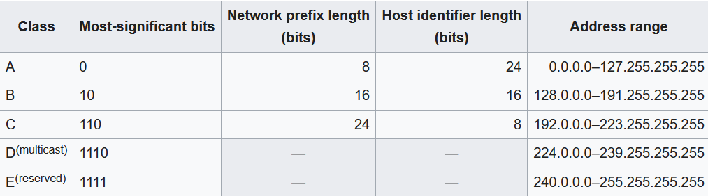

# Week 1 Quiz ( Introduction to Ethernet and Internet Protocol)

1. ### What is not a part of ethernet Frame ? (Ethernet Frame Vs Packet)
    - [X] **Preamble**
    - [ ] CRC
    - [ ] payload
    - [ ] MAC Header 

2. ### Ethernet packet structure in correct Order
    - Preamble 
    - Mac Destination
    - Mac Source
    - Length 
    - Payload
    - Frame Check Sequence
    - IPG (Inter-Packet Gap)

3. ### Cable Issue
- #### Let us consider two cables of 20 meters each. One of them is in a 100MBps network while the other is in a 10MBps network. If you had to transfer data through each of them, how much time it would take for the first bit to arrive in each setting?
    _For your calculation you can assume that the speed of light takes the same value as in the videos. Round the answer to the nearest hundredth._

Speed of Light = $300 * 10^6$
Cable length = 20 mtrs

Network1 = 100MBps => 100 million Bits per second

$$
\displaylines{
100 * 10^6 bits/sec \\ 
\text{Time per bits} = 100 * 10^{-6} => 10^{-8} sec (10ns)\\
}
$$

> for sending 1 bit ~ 10ns of time is taken 

Network2 = 10MBps => 10 million Bits per second

$$
\displaylines{
10 X 10^6 bits/sec \\
\text{Time per bits} = 10 X 10^{-6} => 10^{-7} sec (100ns)\\
}
$$

> for sending 1 bit ~ 100ns of time is taken 

_distanceCovered = Speed X Time_

$$
\displaylines{
\text{TimeTaken} = \frac{20 mtrs}{300 * 10^6} \\
\text{TimeTaken} = 6.6667 * 10^{-8} => 66.67 *10^{-7} \\
\text{TimeTaken} = 66.67 sec\\
}
$$

4. ### Why does a collision occur in an Ethernet network?
    - [X] **Two or more devices attempt to transmit data simultaneously.**
    - [X] **Data are sent across shared medium.**
    - [ ] The Ethernet network is using fiber-optic cables instead of copper.
    - [ ] Cables are too long, causing signal loss.
    - [ ] The network is using full-duplex communication, causing data packets to overlap.
    - [ ] Ethernet switch does not have enough memory to store all data packets.

5. ### Collision Detection ( Bring the steps of collision detection algorithm in correct order. )
    * >Computer A assembles an Ethernet frame
    * >Computer A attempts to send data for the first time
    * >Computer A listens the medium to check anyone sending data already and waits if "the line is busy"
    * >Computer A transmits the first bit of the frame
    * >System checks for collision: If no collision is detected, check if transmission is finished. If there are still more bits, transmit the next bit of the frame in the next clock cycle.
    * >Computer sends another bit check if collision is detected and repeat steps this until transmission is finished or collision is detected.
    * >If collision is detected, Computer A checks if the number of attempts is bigger than max number of attempts. If yes, system will stop sending data to avoid wasting of time or endless loop.
    * >If the max number of attempts is not reached - computer A choses wait number (from 0 to 16)
    * >"Wait" is a loop. Each time we reduce it by one and wait for one time slot or 512 clock cycles; during this time Computer A avoids sending data.
    * >When wait number is 0 - increase the number of attempts by one. Computer tries to send data again starting the first bit.
    * >Sending the data is finished

6. ### What general problems exist while making digital communication over a shared medium?
    - [X] Participants have to have a way not to talk at the same time.
	- [X] Participants have to talk the same language / protocol.
	- [ ] The used protocol has to be an Internet standard
	- [ ] One has to ensure that everyone gets the same amount of time to put data to the shared medium.
	- [ ] Communication must be encrypted.
	- [X] One has to make sure who sends a message and to whom it should be delivered.
	- [ ] Messages have to be delivered correctly and be secured against data loss

7. ### Which of the following statements are characteristic for communication over a shared medium?
    - [ ] The smallest amount of information that can be transferred is a Bit.
	- [X] Everyone who has access to the medium can receive all the data that is being put on the medium.
	- [X] Several computers use the same medium to communicate with each other
	- [ ] Collisions will occur if using a shared medium .
	- [ ] Communication must be encrypted.

8. ### Ethernet makes sure that the data has arrived at the recipient
	- [ ] true
	- [X] false
    > No ethernet has a CRC check sum such that the correctness of the data package can be verified but ethernet does not guarantee a frame to be delivered.

9. ### How many header fields exist in ethernet?
    - 3 -> Source MAC Address, Destination MAC Address and the Ethertype
``` text
 _______________________________________________________________________________________________
|           |     __Mac Header (14 Bytes)__             |   (46-1500 bytes)     |               |
| Preamble  | [Destination Mac] [Source Mac] [Eth Type] |       Data            | CRC ($Bytes)  |
| (8 Bytes) |  (6 Bytes)          (6 Bytes)   (2 Bytes) | [IP. ARP, Etc ...]    |               |
|(01010.. ) |                                           |                       |               |
|___________|_______________Ethernet Type II Frame (64 - 1518 Bytes)____________|_______________|
```
10. ### What is the maximum amount of data that is allowed to be transferred via an Ethernet Frame?
    - [ ] 10 MBit
	- [ ] 100 Mbit
	- [X] 1500 Byte
       > →	according to the protocol specification this is the amount of data that is allowed to be transferred
	- [ ] 1518 Byte

11. ### What does MAC in the context of Ethernet stand for?
    - Media Access Control

12. ### How is a frame called that is shorter than 64 Byte ?
    - Runt frame

13. ### What is the minimum amount of Data that has to be send over ethernet?
    - 46 Bytes

14. ### How much time passes by in a 100 Mbit/s ethernet device per clock cycle?
	- [X] 10 nano seconds
	- [X] 10^-8 seconds

15. ### How much time passes by in 10 MBit/s ethernet device per clock cycle?
	- [ ] 1 nano second
	- [ ] 10 nano seconds
	- [X] 100 nano seconds

16. ### How far can a Bit travel approximately on a 10 Mbit/s ethernet device during one clock cycle?
	- [ ] 100 meter
    - [ ] 1 meter
	- [ ] 3 meter
	- [X] 30 meter
$$
\displaylines{
10 X 10^6 bits/sec \\
\text{Time per bits} = 10 X 10^{-6} => 10^{-7} sec (100ns)\\
\text{distanceCovered = Speed X Time} => 300 * 10^6 * 10^{-7} => 30 meters\\
}
$$ 

17. ### When an ethernet collision is discovered
	- [X] The transmission of the current frame starts again from the beginning.
	- [ ] The transmission of the current frame continues at the point where it stopped when the collision was detected.
	- [ ] The network device waits until the other devices ask it to retransmit the data.
	- [ ] The network starts retransmitting data right away.

18. ### Who can detect a collision?
	- [ ] all devices on the shared medium
	- [ ] the recipients
	- [X] the senders
	- [ ] the senders and recipients

19. ### How big is a slot time?
	- [ ] Maximum ethernet frame size
	- [X] Minimum ethernet frame size
	- [X] 512 Clock cycles
	- [ ] none of the above

20. ### Almost all Internet traffic on the Link Layer consists of ethernet traffic
	- false

21. What is transfered during one ethernet clock cycle?
	- 1 Bit

22. ### Which holds true about the clock of ethernet devices
	- [X] The clocks are synchronized during the transmission process.
	- [X] Transmission speed is reciprocal to the interval length of one clock cycle
	- [X] The clock frequency has an impact to the minimum length of an ethernet frame
	- [X] The clock frequency has an impact to the maximum distance between two ethernet devices.

23. ### What does the robustness principle say?
    - Be conservative in what you do, be liberal in what you accept from others. (__Thats the original wording__)
    - Be conservative in what you send, be liberal in what you accept (__This is a common used reformulation.__)

24. ### Which core problems have been addressed while designing the Internet Protocol ?
    - Enable hosts on two different networks to communicate with each other.
    __→	the internet protocol was indeed design to enable communication over network boundaries.__
    - Creating a tool for decentralized fail-proof communication between hosts.
    __→	Yes this was a core requirement resulting from the fear of a nuclear war.__

25. ### What are the advantages of segmenting networks?
    - Package switching protocols on a shared medium will result in too many collisions if the network is not segmented. 
    - Every network can use its own link layer protocol.

26. ### what are the two parts of an IP address called ?
    - host part and network part

27. ### How many IPv4 addresses do exist ?
    - about 4 billion

28. ### What is achieved by introducing IP addresses?
    - Uniquely identify each host on the internet
    - introduce an address hierarchy 
    - be able to identify the network a computer belongs to

29. ### Why do we need to introduce the network part in IP ?
    - This is done to reduce the amount of entries in a routing table. 

30. How many networks of the following class exist in IPv4
``` text
    Class A                     Class B             
    128 ( = 2^7)                16,384 ( = 2^14)                       

    Class C                     PrivateNetworks
    2,097,152 ( = 2^21 )        273 ( = 1 + 16 + 256 )
```

31. ### How many hosts can exist in the following class of IPv4 networks ?
``` text
    Class A                     Class B                 Class C
    16,777,214 ( = 2^24-2)      65,534 ( = 2^16-2)      254 (= 2^8-2)
```

32. ### A network device from network 100.0.0.0 receives an IP package with the destination IP address 150.1.2.3. Which of the following is true?
    - [X] The network prefix of the destination address is 150.1
    - [X] The destination network is a class B network.

33. ### Read the following article on Classless Inter-Domain Routing. Which are valid entries in a routing table?
``` text
    with CIDR 	    without CIDR
        ✅              ✅             11.0.0.0
		✅              ❌             12.3.1.1
        ✅              ✅             192.162.2.0
        ✅              ✅             192.162.0.0
        ✅              ❌             14.31.0.0
		✅              ❌             14.31.0.1
```
34. ### CIDR is backward compatible
	- yes

35. ### A network device from a class A network receives an IP package with the destination IP address in a class B network. Which of the following is true?
    - If a route to the network of the destination adress exists the package will be routed.
    - If no route to the destination network exists the package will be send to the default route.
    - If the package cannot be routed there will be a forwarding error message send to the source.

36. ### An IP package is sent from host A to Z. It is being routed via B, C and D. Now network D cannot forward the package. Which of the following is true?
    - There will be an error send back to A. The route is not quite clear.

37. ### You are using ethernet II with etherType 0x0800 with a maximum data payload to store a standard IPv4 package with IHL=5. How much data can you put inside one ethernet frame?
    - 1480 Bytes
```text
    Yes the Ethernet frame can have a data payload of 1500 Bytes minus 20 Bytes of IP header.
    Standard Ethernet has a Maximum Transmission Unit (MTU) of 1500 bytes.
    -- Everything inside this 1500 bytes must include the IP Header and the Data.
    -- (IHL = 5) Internet Header Length. It counts the number of 32-bit "words" in the header.
    -- Calculations 5 X 32 = 160 bits = 20 bytes

    ** Final Calculations: 
        Total Eth MTU - IPv4 Header Size 
        1500 bytes - 20 bytes = 1480 bytes.

```

38. ### An IP package has Bit number 49 set to 1 and has a data payload of 2000 Bytes. It now arrives at an Ethernet Network. What will happen?
    - An error message will be send to the sender (specifying the maximum allowed data size)

39. ### An IP package has Bit number 49 set to 0 and has a data payload of 2000 Bytes. It now arrives at an Ethernet Network. What will happen?
    - The package is fragmented into two packages which both fit into the Ethernet frames of the network

40. ### What is DSCP used for?
    - prioritize traffic 
    - increase the profit of internet service provider

41. ### Which of the following becomes possible due to the use of TTL?
    - discarding falsely routed packages

42. ### Which of the IP header files will change while routing?
    - [X] TTL
    - [X] Total Length
    - [ ] source IP address
	- [ ] destination IP address





	
        