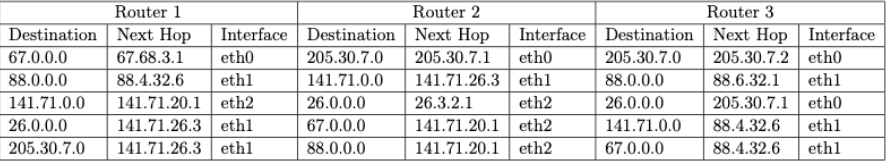
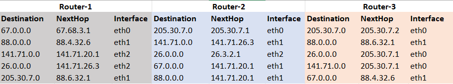

# Week 2 Quiz ( Transmission control protocol and Domain name systems)

1. ### Routing Table (IP)
    Take a look at below routing table and answer the questions associated with it.

    1. Draw the schematic representation of the network based on the Routing Table.1

    2. Find the shortest path of sending information from 205.30.7.0 network to 141.71.0.0 network.
    - **205.30.7.0 -> R3 -> R2 -> R1 -> 141.71.0.0**

Upload your network schema as an image. You can provide the shortest path in the drawing.

