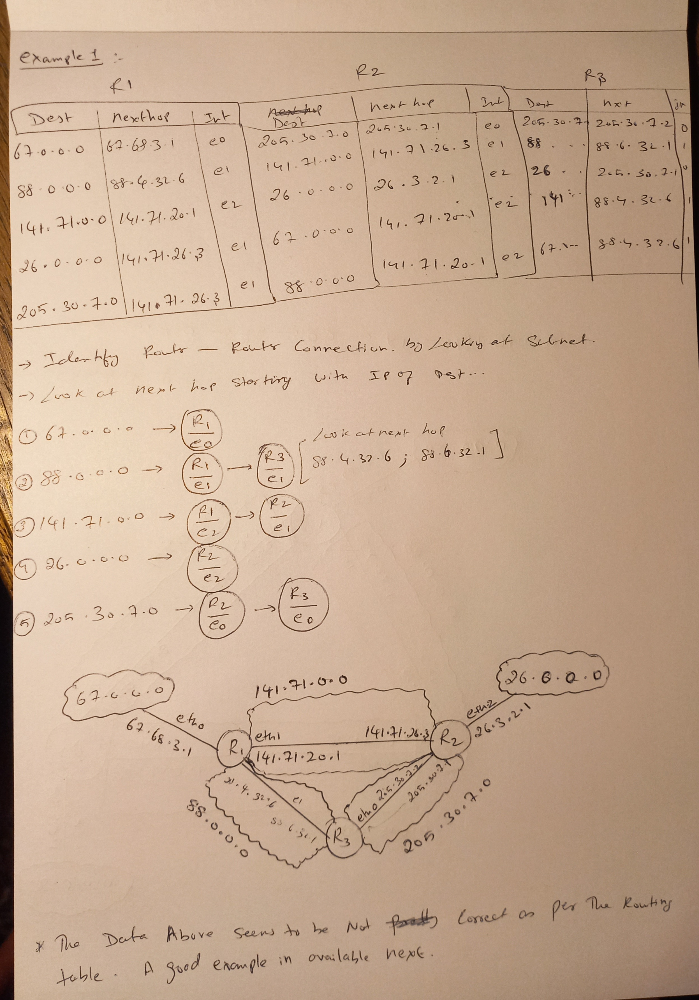
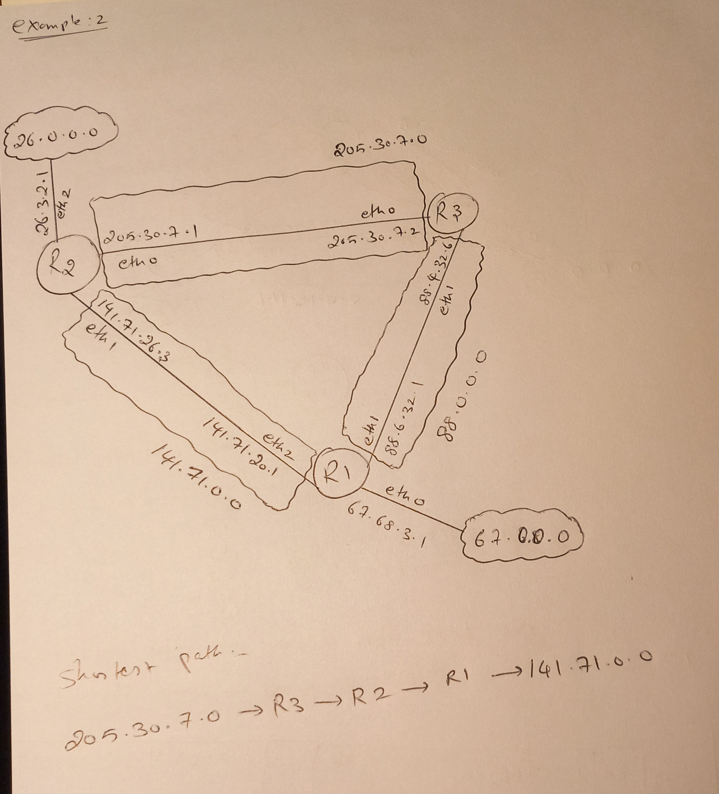
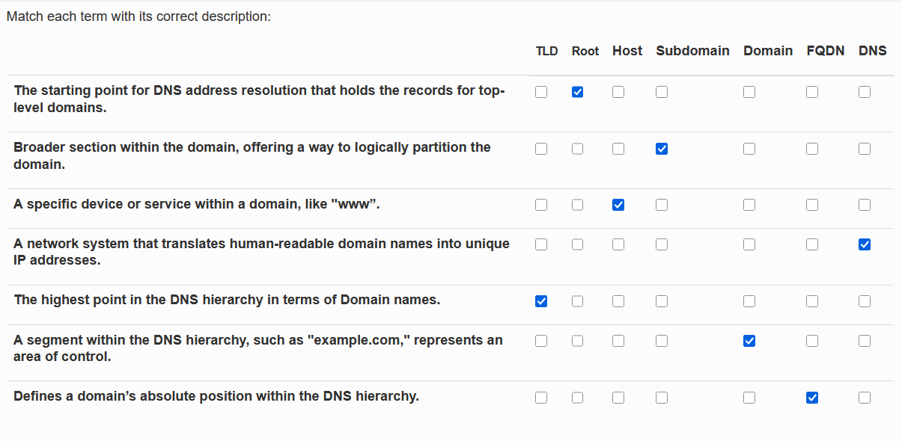
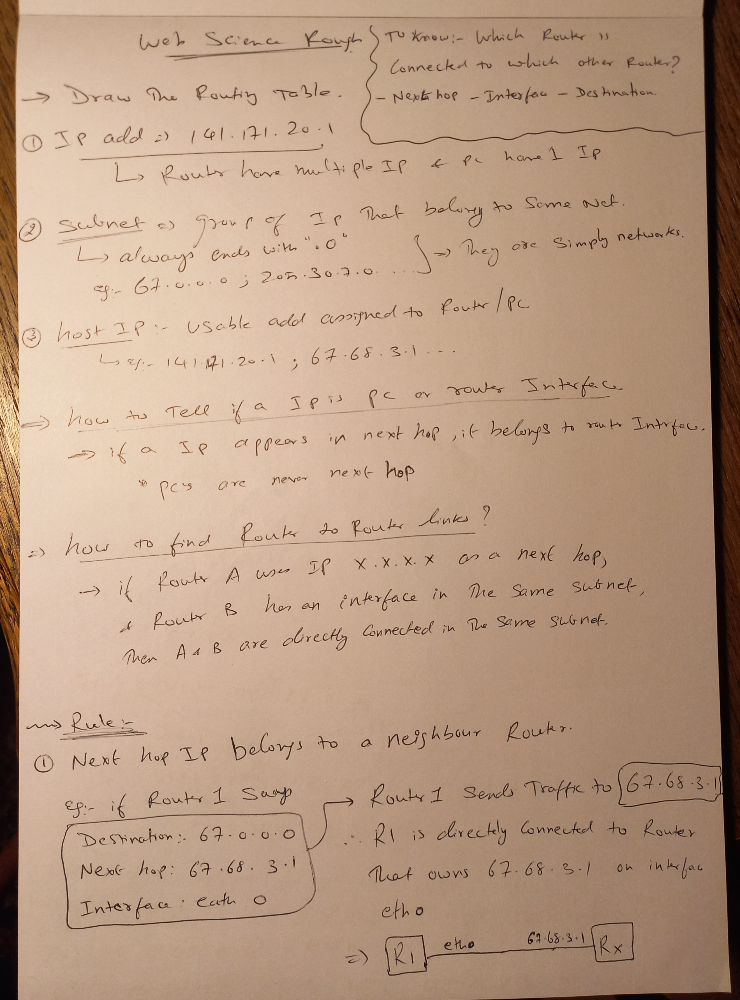
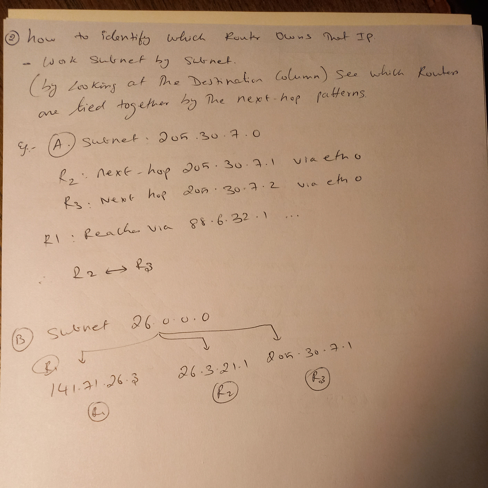

# Week 2 Quiz ( Transmission control protocol and Domain name systems)

1. ### Routing Table (IP)
    Take a look at below routing table and answer the questions associated with it.

    1. Draw the schematic representation of the network based on the Routing Table.1

    2. Find the shortest path of sending information from 205.30.7.0 network to 141.71.0.0 network.
    - **205.30.7.0 -> R3 -> R2 -> R1 -> 141.71.0.0**

    Upload your network schema as an image. You can provide the shortest path in the drawing.
    

    #### Solution :
    

2. ### Understand the Routing table given below and answer the questions associated with it.
    

    1. Draw the schematic representation of the network based on the Routing Table.
    2. Show steps in path traversal if a packet is generated from 205.30.7.0 network and reaching to 141.71.0.0 network.

    #### Solution :
    

3. ### Since file sizes are mostly not of the order of a few kilobytes, what would the challenges if the data are split and then sent across information channel?
    - [X] Reassembling of data packages
    - [X] Re-transmission of packages
    - [X] Loss or damage of packages
    - [X] Varying network speed

4. ### What of the following is true for Sliding Window?
    - [X] The limits on window size vary depending on the rate at which the receiving computer can process the data packets
    - [X] The goal is to keep track on the reception and order of packages
    - [X] It is used to identify duplicated or missing information.
    - [X] The concept of window refers to the amount of information that can be processed by the receiver
    - [ ] It reduces the risk of congestion in the network.
    - [ ] The protocol speeds up data transmission by ignoring errors in packets
    - [ ] It discards packets if they arrive out of order

5. ### DNS Terminologies


6. ### DNS Address Resolution
    > The client’s local DNS resolver checks its cache to see if it already has the IP address for the destination.
    > The client’s DNS resolver contacts a root DNS server to identify server responsible for the "com" top-level domain.
    > The client’s DNS resolver queries the "com" TLD server to locate the DNS server for "google.com".
    > The client’s DNS resolver sends a request to the DNS server for “google.com” to obtain the IP address.
    > The DNS server for "google.com" responds with the IP address.
    > The client’s DNS resolver stores the response in its cache and returns the IP address to the client.

7. ### Connection oriented VS connection Less
``` text
    Description / Protocol	                                                 Connection-oriented	Connection-less
    It establishes a connection between sender and receiver 
    before transmission of data can begin.	                                          ✅	            ❌

    It keeps track of the status of that connection.	                              ✅	            ❌

    It allows data to be transmitted or exchanged without a proper 
    link or reliable connection between the processes.	                              ❌	            ✅

    TCP(Transmission Control Protocol)                                                ✅	            ❌

    UDP(User Datagram Protocol)                                       	              ❌	            ✅

    IP (Internet Protocol)	                                                          ❌	            ✅

    ICMP (Internet Control Message Protocol)                                          ❌	            ✅
    
    ATM	(Asynchronous Transfer Mode)                                                  ✅	            ❌
```

8. ### Hand Shake
    > 1. Sender sends the SYN Flag to Receiver with a 32 bit sequence number.
    > 2. Receiver on receiving SYN Flag sends back ACK Flag with an acknowledgement number which is sender’s sequence number +1 and another SYN Flag with its own generated sequence number.
    > 3. Sender on receiving the ACK Flag and notifies the recipient that it has got the package.
    > 3. Sender adds the Receiver's sequence number +1 and sends it back through ACK Flag.

9. ### Which of the following protocols is connection oriented
    - Ethernet
	- Wifi
	- Internet Protocol
	- [X] task name Transmission control protocol
	- HTTP
	- token ring

10. ### What are the aims of the transmission control protocol?
    - [X] creation and management of network connections
    - [X] enabling a way of communication between networks of different speed without overloading the slower network
    - [X] creating a reliable way of communication
    - [ ] finding the fastest way through an IP network
    - [ ] encrypting IP traffic for security reasons.

11. ### What is the aim of flow control?
    - [ ] finding the fastest way through an IP network.
    - [X] enabling a way of communication between networks of different speed without overloading the slower network
    - [X] creating a reliable way of communication
    - [ ] encrypting IP traffic for security reasons.

12. ### Which flags are set in which phase of the handshake messages
```text
    SYN	ACK
    ✅      1st Message
    ✅ ✅   2nd Message
        ✅  3rd Message
```

13. ### What is the difference between a TCP client and a TCP server?
	- [ ] only if the client asks for data the server can respond with data
	- [X] only clients can start the process of a three way handshake
	- [ ] only servers can start the process of a three way handshake
	- [X] once the connection is established both the client and server can send data at any time.
	- [ ] there is not difference between client and server

14. ### Once the three way handshake was used to establish a connection. What will happen if a packet from host A is not acknowledged?
    - [X] the packet will be send over and over again by A
    - [ ] the connection will be closed by A
    - [ ] A initiates a trace root so that it can decide if there is still a physical connection with the recipient.
	- [ ] A will send the packet again with an increased priority

15. ### How many port numbers are placed in a TCP package?
    - 2 (source port and dest port)

16. ### A TCP port number consists of how many bits?
    - 16 bits

17. ### What is a network socket?
    - a pair consisting of an IP address and a port number

18. ### What kind of incoming TCP packets are usually accepted by a host?
    - all packets where the destination port is the same as an open port of the host.
    - all packets where the destination port corresponds to solicited traffic. 

19. ### What port number is chosen as the source port of outgoing TCP packets?
    - a random number that is not used as source port for any established connection of the host and is not an reserved port

20. ### How do you calculate the maximum number of different packets you are allowed to send on a TCP connection without acknowledgement assuming the packet size exceeds the maximum segment size (mss)?
    - window size divided by the minimum mss of the sender and receiver.

21. ### What is the purpose of sliding windows in TCP?
    - to protect slow network interfaces to be overload with traffic from fast network interfaces
	- to decrease the latency while using the Stop and Wait heuristic

22. ### Which is core to TCP
    - End to end principle
    - ports

23. ### Look at the tree which represents the domain name system. What do edges in the tree map represent in a domain name?
    - . (Dot)

24. ### Look at the tree which represents the domain name system. What do all the nodes except the root node in the tree map have?
    - words

25. ###

### Notes



